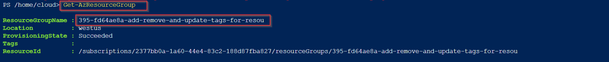
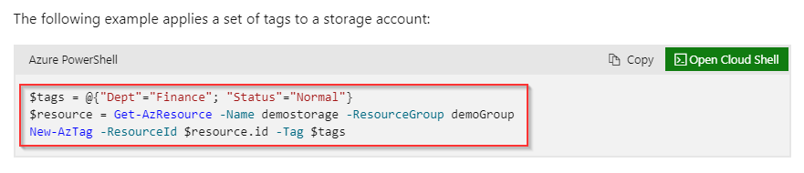
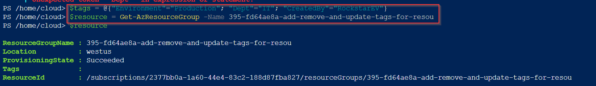
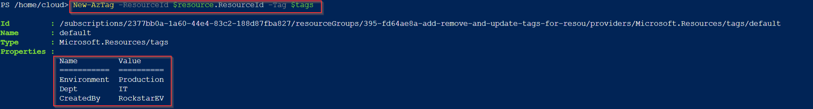
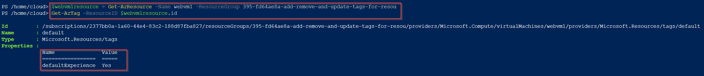
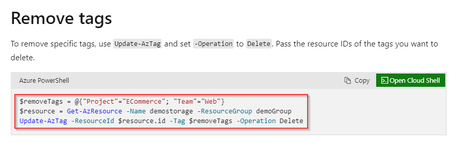
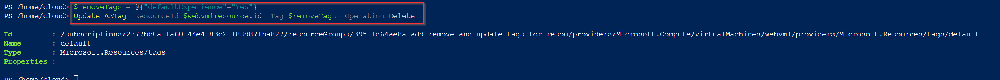
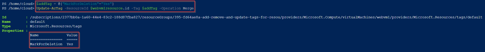
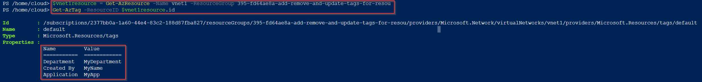
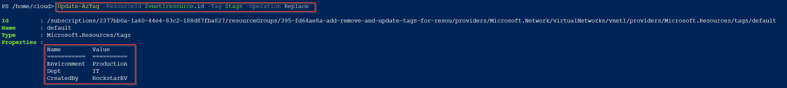

# Add, Remove and Update Tags for Resources in Azure

**There are 3 objectives with this lab:**
* Add Tags to the Resource Group
* Remove Tags for VM and Mark for Deletion
* Change Tags for the Virtual Network

## Add Tags to the Resource Group

So this entire lab is pretty much in in the Azure CLI using PowerShell so lets go ahead and create a storage account so we're able to use PowerShell. Once that's completed, we're asked to list all resource groups in this lab.  

There's only one resource group in this lab. Once that's listed, we're asked to apply the following tags to the entire resource group: `Environment=Production`, `Dept=IT`, and `CreatedBy=YourName` and in this case, I'm using my name, RockstarEV. I've never applied tags
to a resource in Azure, let alone have done it using PowerShell so I searched the Microsoft website ([link here](https://learn.microsoft.com/en-us/azure/virtual-machines/windows/quick-create-powershell)) and found the following commands:

)

The first command creates a variable named `$tags` that is then given the information for the tags. The second command creates a variable named `$resource` that gets the value of the resource and the resource group its in. The third command passes the tag information
by using the -ResourceId argument. I used the same tag and resource variables. 

)

I then printed the `$resource` variable just to make sure it was given the correct RG. Afterwards, I used the `New-AzTag` command listed on the website to give the resource group the required tags.

)

You can see from the above screenshot that the resource group now has the 3 tags required in the lab. 

## Remove Tags for VM and Mark for Deletion

Next, we had to remove the tabs from a virtual machine. First, we had to list out the current tags on the VM.  

)

The only tag it had was the `defaultExperience=Yes` tag. We need to remove this tag. I used the same Microsoft webpage to find the remove tag commands. 

)

I created a new tag variable named `$removeTags` and it had the value of the original tag on the VM. Then, I passed the Update-AzTag and the Delete operation just as it was listed on the website. 

)

You can now see that the resource has no tags. Now, we need to add the `MarkForDeletion=Yes` tag to this VM. 

)

I used the same commands as the apply tag but I chose a new variable named `$addTag` just to keep things separate. With the `Update-AzTag` command, I used the Merge operation. Now, the VM has the new tag.

## Change Tags for the Virtual Network

Lastly, we're told to list the associated tags on a virtual network. I create a new variable for the vNet `$vnet1resource` and then use the `Get-AzTag` on the variable.

)

We now have to overwrite the above tags with the new tags from the first section of this lab. I used the `Update-AzTag` cmdlet but for the Operation argument, I used Replace. This overwrites the old tags with the new tags. 

)

That concludes this lab. 

## Personal Notes

